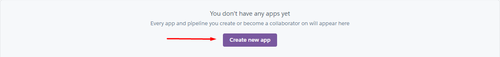
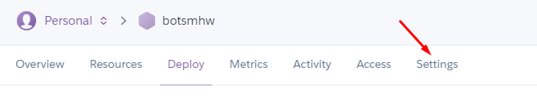
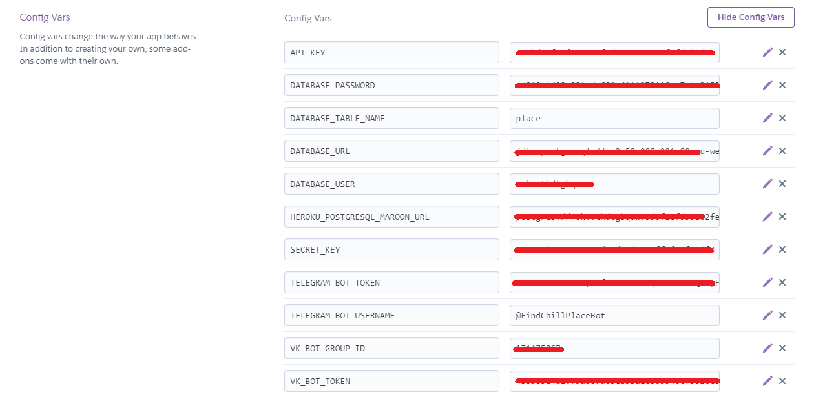
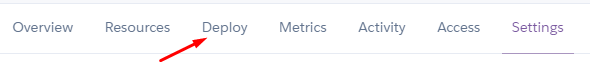
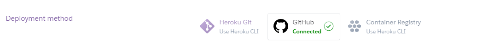
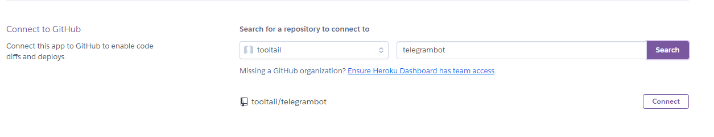
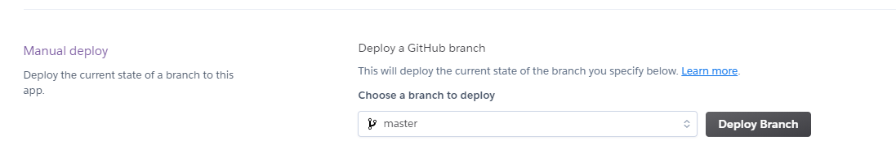

#1
:shipit: \
Задача - создать БД(postgresql), где будут храниться название и адрес баров
+ возможность добавлять новые бары (т.к. используется БД - она может быть изменена - добавлены новые места, удалены старые и т.д.)
+ выводить список уже добавленных баров

Пример диалога:

>**/add** \
    Выберите категорию, в которую Вы хотите добавить заведение: \
        *Bar* \
    Укажите название заведения: \
        *Televisor* \
    Укажите адрес заведения: \
        *Radisheva, 4*

>**/add**  
Выберите категорию, в которую Вы хотите добавить заведение:  
    Bar  
    Укажите название заведения:  
        *Melodiya*  
    Укажите адрес заведения:  
        *Pervomayskaya, 36*

>**/bars**  
    Список баров:  
        Televisor (Radisheva, 4)  
        Melodiya (Pervomayskaya, 36)

#2 
:shipit: \
Задача - возможность ставить оценку заведению, в котором побывал пользователь

Пример диалога:

>**/rate**  
    Select the category in which you want to rate the establishment:  
        *Bar*  
    Enter the name of the establishment:   
        *Televisor*  
    Enter the address of the establishment:  
        *Radisheva,4*  
    Rate the establishment (between 1 and 5):  
        *100*  
    The rate must be between 1 and 5  
        *(buttons from 1 to 5)*  
    Your rate was added ;)

#3
:shipit: \
Задача - возможность находить бары (использование api для нахождения координат места: https://dadata.ru/api/geocode/) в радиусе 2 км и сортировать по оценкам (места будут расположены в порядке уменьшения рейтинга) + деплой бота на Heroku \
Пример диалога:
>**/nearestBars**  
Please share your geolocation or enter your current address  
Stachek, 70  
*(User uses button to send geo or just types his address in the chat)*  
Nearest bars:  
*Squirrel (Krasnoflotsev, 2)  
rate: 4,00/5  
distance: 1,41 km*

Пример, если заведений в радиусе 2 километров нет:
>**/nearestBars**  
Please share your geolocation or enter your current address  
*(User uses button to send geo or just types his address in the chat)*  
Nearest bars:  
*There are no bars near you*
## Деплой бота на Heroku    
**1)** Регистрируемся на Heroku.com
    
**2)** Создаем новое приложение 
    
**3)** Переходим во вкладку Settings     
**4)** Указываем необходимые переменные, которые используются непосредственно в коде
   
**5)** Переходим во вкладку Deploy 
    
**6)** С помощью GitHub привязываем наш аккаунт к Heroku
    
**7)** Находим необходимый для деплоя проект (telegrambot в нашем случае) и нажимаем *Connect*
    
**8)** Выбираем *Deploy Branch*
    
**9)** ~~Потратив пару часов в попытках разобраться с остальными ошибками деплоя~~, Вы наконец-то сделали это! Поздравляю! Ваш первый деплой!

